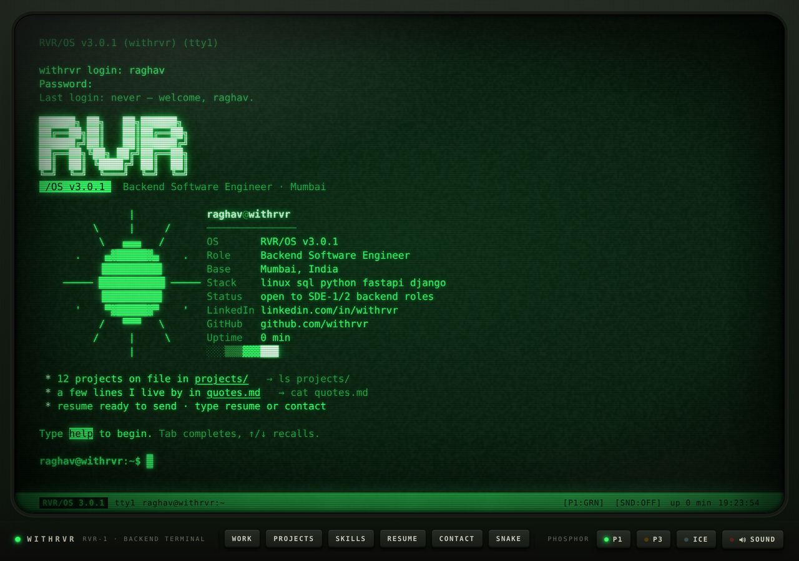

# RVR/OS v3.0.1

Personal portfolio of **Raghav Rathi** ([withrvr](https://github.com/withrvr)) —
a CRT-terminal simulation you drive by typing commands. One static HTML
file, no framework, no build step.

**Live:** https://withrvr.github.io &nbsp;·&nbsp; try `help` once it boots.

## How it's built

Classic static site, three files:

- `index.html` — the whole thing: HTML, CSS, and JS, self-contained.
- `llms.txt` — a plain-text mirror of the site for AI agents/bots, per
  [llmstxt.org](https://llmstxt.org).
- `favicon.svg`
- `resume/index.html` — static redirect: `/resume` → the resume link.

`.github/workflows/deploy.yml` stages those files and publishes them to
GitHub Pages on every push to `main`. There's nothing to install and
nothing to compile; open `index.html` directly in a browser to preview it.

See [`docs/v3.md`](docs/v3.md) for more.

## Credit

Built from **HELIOS/OS v2.3 — Phosphor Terminal**, a template from
[Claude-Opus-5.5-100-HTML-Files](https://github.com/miaai-lab/Claude-Opus-5.5-100-HTML-Files)
by [miaai-lab](https://github.com/miaai-lab), personalized and extended
for this portfolio.

## License

[MIT](LICENSE) © Raghav Rathi
